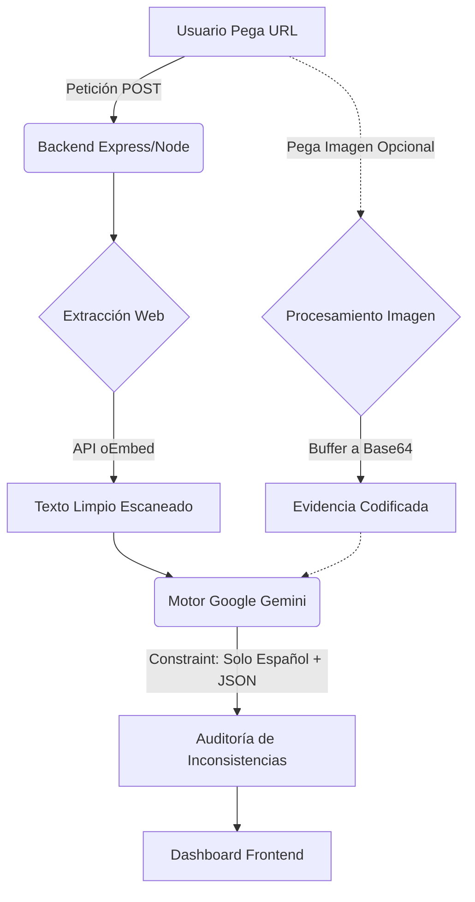

# 📑 INFORME DE EXPOSICIÓN FINAL
**Materia:** [Nombre de la Materia / Ingeniería]  
**Alumno:** Tharsis Gabriel  
**Proyecto:** Verifact AI (Fact-Checking Multimodal)

---

## 🎤 1. Introducción al Veredicto (El Discurso de Apertura)
*Sugerencia de exposición:*  
"Buenos días jurado/profesores. Mi nombre es Tharsis Gabriel y presento **Verifact AI**. En la era de la desinformación en redes, las 'Fake News' y las imágenes generadas por IA circulan sin control. Para combatir esto, he desarrollado un prototipo funcional de Inteligencia Artificial que no solo verifica textos de plataformas cerradas como X (Twitter), sino que cuenta con capacidad híbrida de *Visión Artificial* para encontrar contradicciones entre un texto engañoso y una prueba fotográfica verdadera."

---

## 🏗️ 2. ¿Cómo funciona la Máquina? (Demostración de Arquitectura)

*Durante la exposición, puedes mostrar este flujo visual (o guiarte de él) para explicar el proceso detrás del botón "Verificar":*

### Explicación Técnica Simplificada:
Cuando se analiza un enlace, ocurren 3 cosas críticas en fracciones de segundo:
1. **El Bypass de Redes:** Debido a las políticas de la API de Twitter de Elon Musk, los endpoints tradicionales están bloqueados. El Backend soluciona esto usando sindicación de contenido web público, trayendo código HTML crudo y limpiándolo con expresiones regulares nativas.
2. **Transformación Multimodal:** Si proporciono una fotografía de contexto, el servidor Express la asimila, destruye y reconstruye como una larguísima cadena en Base64, inyectándola directo a la corteza visual de Gemini Generative AI.
3. **El Cerrojo Cognitivo (Prompting Estricto):** Usando Ingeniería de Prompts (Prompt Engineering), acorralé a la IA de Google para que *únicamente* pueda devolverme un bloque de datos JSON formateado y forcejeé su lógica lingüística incluyéndole la directiva estricta de que piense y redacte **solamente en español**.

---

## 🧩 3. Partes Críticas del Código (Para mostrar al jurado)

*Si te piden abrir el código, guíalos a estas 3 joyas de tu proyecto:*

### A) El Motor Inteligente (`server.js` - Función `performFactCheck`)
Aquí armaste la orquestación. Menciona cómo diseñaste una **Resiliencia en Cascada**:
Si el modelo primario (`gemini-2.5-flash-lite`) falla o la conexión a internet cae, elaboraste un bloque de error estructurado o "Modo Demo" en JSON. Esto significa que **en una demostración técnica, tu sistema jamás colapsa ni muestra una pantalla blanca**.

### B) La Cosechadora de Textos (`server.js` - Función `getTweetSourceData`)
Muestra cómo usas los objetos nativos global `fetch` de Node.js 22. No usas bibliotecas pesadas de Scraping (como Puppeteer) para tu prototipo, sino que aprovechas un endpoint de publicación. Esto es rendimiento y eficiencia en su estado puro.

### C) Prevención de Colapsos en Memoria (`App.tsx` - Función `renderDashboard`)
En React, la acumulación de un historial corrupto destruye el Virtual DOM. En tu Frontend, programaste una asimilación defensiva del caché local (`localStorage`), donde mapeas de forma segura solo elementos que cumplan la estructura de `veracity_score`. Muestra el diseño premium del "Dashboard", donde se consumen estos datos para armar la analítica.

---

## 🏁 4. Cierre y Conclusión
"Técnicamente, Verifact AI no es solo un puente a una API. Es una pasarela de asimilación de datos. Recoge HTML e imágenes, transita en la red mediante REST, controla cognición de LLMs avanzados y entrega veredictos reactivos. Un sistema resiliente, preparado para la actualidad."

***(Momento de la demostración visual en vivo en localhost:5173 con un post de Twitter y una imagen)***
