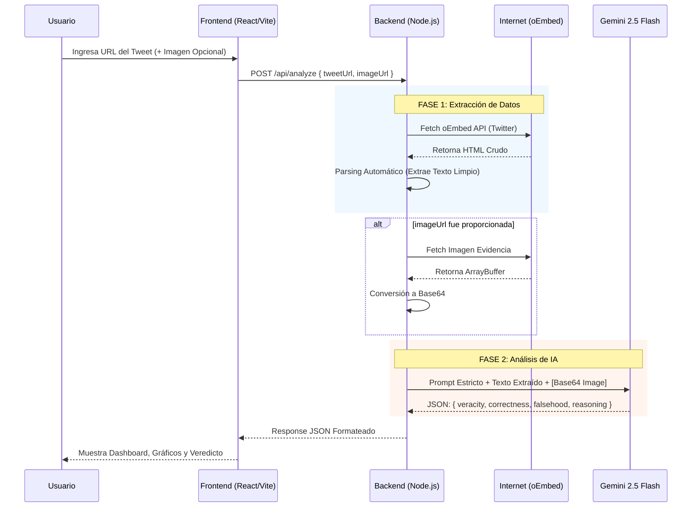

# Verifact AI 🛡️
**Proyecto Final Universitario**  
*Desarrollado por Tharsis Gabriel*

Verifact AI es una plataforma de **Fact-Checking Multimodal en Tiempo Real**. Utiliza extracción nativa de contenido web e Inteligencia Artificial Generativa (Google Gemini) para evaluar la veracidad de publicaciones en plataformas sociales como X (Twitter), analizando tanto texto como evidencia fotográfica.

---

## 🗺️ Arquitectura del Sistema (Diagrama de Flujo)

El proyecto funciona bajo una arquitectura robusta Cliente-Servidor. A continuación se presenta el flujo exacto de los datos desde que el usuario introduce un enlace hasta que recibe el veredicto:

---

## 📂 Archivos y Código Clave

El sistema ha sido estructurado para ser limpio y escalable.

### 1. `server/server.js` (El Cerebro Backend)
Es un servidor Express ligero pero increíblemente resiliente. Responsabilidades:
- **`getTweetSourceData(url)`**: Evita las "alucinaciones" de la IA descargando el contexto real del tweet a través del endpoint oEmbed de Twitter, limpiando las etiquetas HTML.
- **`fetchImageAsBase64(url)`**: Descarga copias binarias de imágenes proporcionadas por el usuario, preparándolas para el envío multimodal a Gemini.
- **`performFactCheck(...)`**: Orquesta el flujo armando un *Prompt de Grado Académico*. En este prompt se incluye un "cerrojo de idioma" (`ATENCIÓN OBLIGATORIA: Escribe TODAS tus respuestas en ESPAÑOL`) para controlar el output de Gemini. Además, gestiona la redundancia, cayendo a procesos secundarios (Demo Mode) si la API de Google cae, garantizando que la app nunca se quede en blanco durante una demostración.

### 2. `src/App.tsx` (La Experiencia Frontend)
Aplicación React construida con Vite, TailwindCSS y Framer Motion. 
- **Gestión de Estado**: Usa `useState` para manejar múltiples variables de forma reactiva (Cargas, Errores, Resultados).
- **Almacenamiento Local (`localStorage`)**: Inyecta un sistema de retención de historial de análisis, permitiendo poblar un "Dashboard" estadístico basado en las consultas anteriores sin necesidad de usar bases de datos pesadas (como Supabase o MongoDB) para los alcances del prototipo.
- **Micro-interacciones**: Asegura que el usuario vea componentes vivos (loaders, score bars que se animan, botones de "Copiar al portapapeles" reactivos).

### 3. `src/components/AnalysisResult.tsx`
El módulo de renderizado del Veredicto. Diseñado emulando consolas analíticas de seguridad de alto nivel, divide la respuesta JSON de Gemini en cartas de "Lo Verdadero" (Correctness) y "Lo Falso" (Falsehood), destacando con un color semántico el `Veracity Score`.

---

## 🛠️ Tecnologías Empleadas

- **Frontend**: React 18, Vite, Tailwind CSS, Framer Motion, Lucide Icons.
- **Backend**: Node.js 22, Express, `@google/generative-ai` (SDK de Gemini).
- **Inteligencia Artificial**: Google Gemini 2.5 Flash Lite (Modelo principal).

---

## 🚀 Cómo Ejecutar el Proyecto
1. **Clonar/Abrir** la carpeta del proyecto.
2. Añadir un archivo `.env` en la raíz con: `GEMINI_API_KEY=tu_clave_aqui`.
3. Iniciar Backend: `cd server && node server.js` (Correrá en el puerto 3010).
4. Iniciar Frontend: Abrir otra consola y correr `npm run dev` (Correrá en el puerto 5173).
